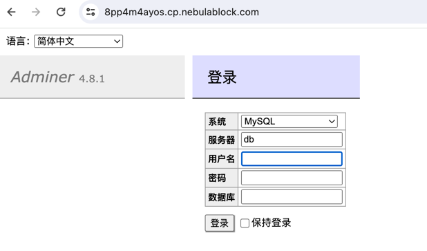
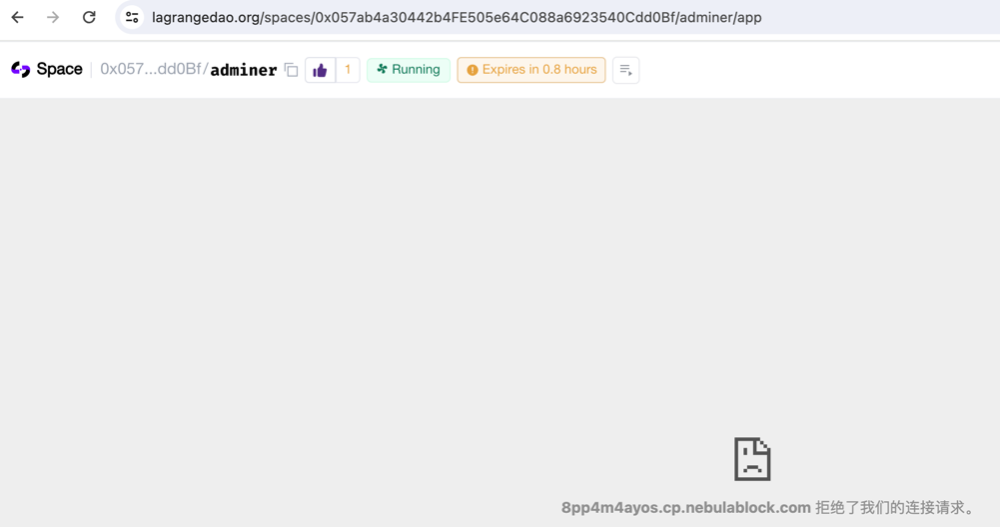

# Adminer

https://lagrangedao.org/spaces/0x057ab4a30442b4FE505e64C088a6923540Cdd0Bf/adminer/app

Adminer (formerly phpMinAdmin) is a full-featured database management tool written in PHP.
Conversely to phpMyAdmin, it consist of a single file ready to deploy to the target server.
Adminer is available for MySQL, PostgreSQL, SQLite, MS SQL, Oracle, Firebird, SimpleDB, Elasticsearch and MongoDB.
